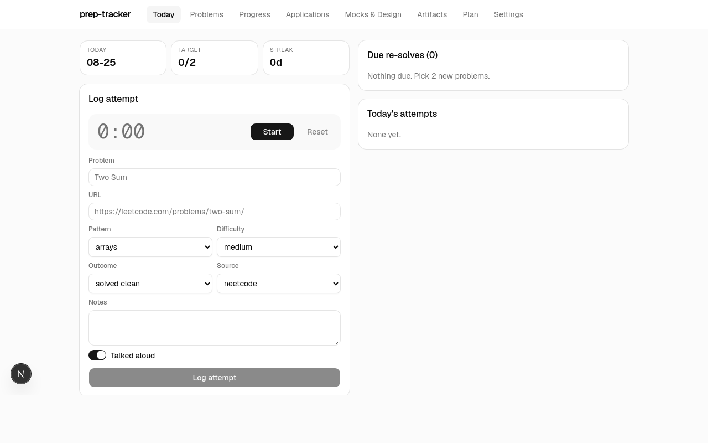
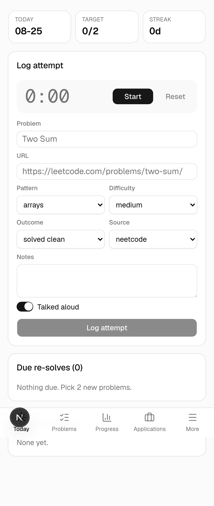

# prep-tracker

A small, single-user web app for tracking a 10-week software-engineering interview prep program: timed problem attempts with spaced re-solves, mocks, system-design reps, a portfolio checklist, an applications kanban, and the weekly plan. Built to be opened every morning on a phone.





## Stack

- **Next.js 16** (App Router, Server Components, server actions) + TypeScript
- **shadcn/ui** + Tailwind CSS 4, **Recharts** for the four progress charts
- The whole app state is **one JSON document**, stored in **Supabase** (a single-row `app_state` table, `supabase/schema.sql`) or **Upstash Redis** — whichever env vars are set. No ORM, no per-feature migrations. Falls back to a local JSON file in development.
- **Vitest** for the domain logic, GitHub Actions for lint / typecheck / test / build
- Deployed on **Vercel** (Hobby tier)

## How it works

- Every timed attempt is a row: pattern, difficulty, outcome, duration, what stopped me, talked-aloud.
- After an attempt, re-solves are scheduled at **+3 days** and **+14 days**. A re-solve counts if it's solved clean within target time (easy ≤ 8 min, medium ≤ 15, hard ≤ 30); otherwise the schedule restarts. Two clean re-solves = **mastered**. Due re-solves show first on the Today page.
- The domain rules live in [`src/lib/logic.ts`](src/lib/logic.ts) as pure functions with [tests](src/lib/__tests__/logic.test.ts); pages are Server Components that call them; all writes go through server actions in [`src/app/actions/`](src/app/actions/).
- Single password gate via [`src/proxy.ts`](src/proxy.ts); dates stored UTC, shown in Asia/Manila.

There is an in-app **Help** page (`/help`) describing the daily routine, outcome definitions, the re-solve/mastery rule, and how recommendations are prioritised.

## Development

```bash
npm install
npm run dev        # http://localhost:3000 — data in .data/state.json, no login
npm test           # vitest
npm run lint && npm run typecheck
```

## Deploy (Vercel Hobby + Supabase)

1. Supabase → New project (Singapore). SQL Editor → paste `supabase/schema.sql` → Run.
2. Supabase → Project Settings → API: copy **Project URL** and the **service_role** key (not anon).
3. Vercel → Import the repo → Settings → Environment Variables: `SUPABASE_URL`, `SUPABASE_SERVICE_ROLE_KEY`, `APP_PASSWORD`.
4. Deploy. Sign in once per device; the cookie lasts a year. Settings → Export JSON is the backup.

Upstash Redis works instead of Supabase: connect it from Vercel's Storage tab and skip steps 1–2.

## Conventions

Conventional Commits, short-lived `feat/ fix/ chore/` branches, squash-merge to `main`, PR template in `.github/`. Full spec and working standards in [`CLAUDE.md`](CLAUDE.md).
